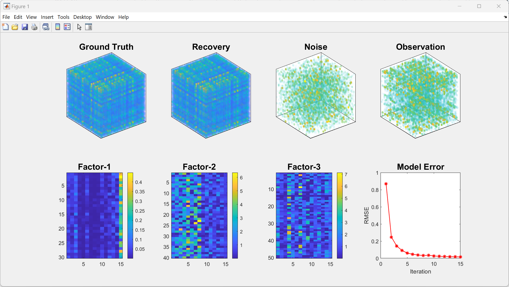

# BNTC (Bayesian Nonnegative Tensor Completion)

MATLAB source codes of the Bayesian Nonnegative CP Factorization for Tensor Completion algorithm presented in the manuscript  [Bayesian Nonnegative Tensor Completion with Automatic Rank Determination ](). (Submitted to IEEE Transactions on Image Processing)


## Usage

Data recovery with BNTC on example synthetic data:
```matlab
A_toy_example.m
```


## Descriptions of the files in this repository

 - *A_toy_example.m* provides example usage of BNTC for synthetic data recovery.
 - *BayesianNNCP_Gibbs.m* implements BNTC described as Alg.1 in the [manuscript]().


## A toy example

